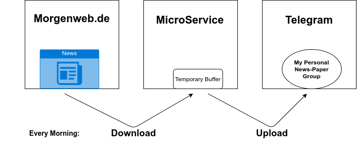

# Newspaper Down And Up Loader
Each morning this MicroService downloads my newspaper and uploads it to my personal telegram group (single member  group).



If you want to use this program you need a digital subscription of [Morgenweb.de](https://abo-bergstraesser-anzeiger.morgenweb.de/?hnr=paywall])

<br/>

## Setup
.. \
.. \
..


### Run
```sh
crontab -e
```
### Add line
```sh
0 5   *   *   1,2,3,4,5,6   /YOUR_PATH/Main.py
```

### If you want another schedule:
```
*     *     *     *     *  Command
-     -     -     -     -
|     |     |     |     |
|     |     |     |     +----- Weekday (0 - 7) (Sunday is 0 and 7)
|     |     |     +------- Month (1 - 12)
|     |     +--------- Day (1 - 31)
|     +----------- Hour (0 - 23)
+------------- Minute (0 - 59)
```